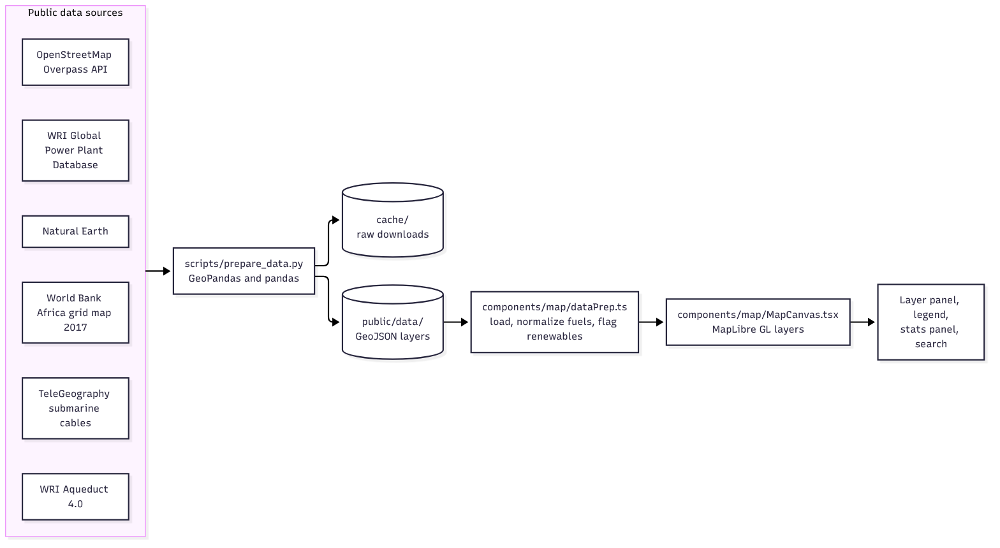

# Africa Power Atlas

An interactive map of Africa's power infrastructure: power plants, transmission lines, substations, submarine cables, data centers and water stress, all on one globe.

**Live map:** https://africapowergrid.vercel.app/

## Architecture



The project has two parts. A Python script downloads the public datasets, clips them to Africa and writes clean GeoJSON files. A Next.js app then loads those files in the browser and draws them with MapLibre GL.

## What the map shows

| Layer | Source |
|---|---|
| Power plants | WRI Global Power Plant Database |
| Transmission lines | World Bank Africa Electricity Transmission and Distribution Grid Map (2017) |
| Planned upgrades | Derived from the transmission layer |
| Substations | OpenStreetMap, through the Overpass API |
| Submarine cables | TeleGeography Submarine Cable Map |
| Data centers | OpenStreetMap plus a curated list of major sites |
| Water stress | WRI Aqueduct 4.0 country rankings |
| Countries, provinces, place labels | Natural Earth |

## Features

- Filter power plants by fuel type, or show renewables only
- View plants as points, clusters or a heatmap
- Search by country or region
- Six basemap themes: Dark, Light, Streets, Hybrid, Satellite and Minimal
- Stats panel and map legend

## Run it locally

You need Node.js and Python 3.

```bash
git clone https://github.com/Ambuso/Africa-Power-Atlas.git
cd Africa-Power-Atlas

npm install
pip install geopandas pandas requests

npm run prepare:data   # downloads the sources and writes public/data/
npm run dev            # http://localhost:3000
```

The prepared GeoJSON files are not stored in the repository, so run `prepare:data` before the first start. The substations step queries OpenStreetMap and can take a few minutes.

Useful options for the data script:

```bash
python scripts/prepare_data.py --only plants,transmission   # run selected steps
python scripts/prepare_data.py --force                      # ignore the cache and download again
```

### Basemaps

The map works without any API key. The default Dark and Minimal basemaps are built from Natural Earth layers committed in `public/basemap/` (rebuild with `python scripts/build_basemap.py`), with terrain shading from AWS Terrain Tiles. Light and Streets use free OpenFreeMap styles; Hybrid and Satellite use Esri World Imagery.

Optional: add `NEXT_PUBLIC_MAPTILER_KEY=` to `.env.local` to use MapTiler for Light and Streets instead.

## Project structure

```
app/                  Next.js pages and global styles
components/map/       map canvas, layers, themes, legend, data loading
components/sidebar/   layer and filter panel
components/panels/    stats panel
components/topbar/    search and view mode
lib/                  shared types and country list
scripts/              prepare_data.py, the data pipeline
```

## Built with

Next.js, React, TypeScript, MapLibre GL, Tailwind CSS, Python, GeoPandas
